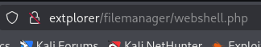
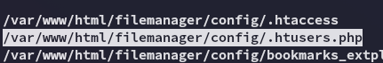
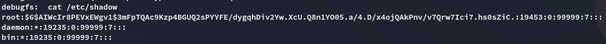

**Start 20:24 07-05-2025**

---
```
Scope:
192.168.184.16
```
## Recon

### Nmap

```bash
sudo nmap -sC -sV extplorer -sT -T5 --min-rate=5000 -Pn -vvvv -p-

PORT   STATE SERVICE REASON  VERSION
22/tcp open  ssh     syn-ack OpenSSH 8.2p1 Ubuntu 4ubuntu0.5 (Ubuntu Linux; protocol 2.0)
80/tcp open  http    syn-ack Apache httpd 2.4.41 ((Ubuntu))
| http-methods: 
|_  Supported Methods: GET HEAD POST OPTIONS
|_http-server-header: Apache/2.4.41 (Ubuntu)
Service Info: OS: Linux; CPE: cpe:/o:linux:linux_kernel
```

### 80/TCP - HTTP

I head on over and get routed to the following URL right away.


Not too sure whether this is supposed to be exposed...or whether we can exploit it 🤔

I looked it up and found a juicy [Bug Bounty WriteUp](https://medium.com/@srilakivarma/%EF%B8%8F-%EF%B8%8F-how-i-hacked-a-wordpress-setup-and-gain-admin-privilege-and-got-paid-for-it-98a49433519f) about this exact topic, let's see if we can follow along:


This walkthrough was a bust as I was not able to create a `sql` account on the linked website, neither did simple testing pass this page:


So instead I launched `feroxbuster` and started enumerating.

#### Feroxbuster


I tried out this endpoint instead:


Cool we get a login page!


Nice, simple `admin - admin`, let's try it out.


We get in and I notice 2 users:


I went ahead and changed *dora* to **Admin** status as well, who knows if anything good will come from it.

Let's try to find some sort of exploit:


I was able to upload a webshell 




EZ PZ

## Foothold
### Shell as www-data

From here I just had to send myself a reverse shell:


I used the `upload` feature on penelope to upload `linpeas.sh` and other stuff to enhance my exploitation:


I found that *dora* is part of the **disk** group.



This file looks rather interesting?

I went on and viewed it via the website just because I still had access:


Turns out there's a hash hidden in here.

### Hash cracking time


Let's crack this shit:


EZ PZ

### Shell as dora


#### local.txt


## Privilege Escalation
### Exploiting disk group privs

From my enum I had already found that *dora* is part of the **disk** group, let's find out how we can exploit this.

I found a handy [guide for this](https://www.hackingarticles.in/disk-group-privilege-escalation/):


#### proof.txt

Following this principle I got `proof.txt` super easily:


But seeing as we actually need *root* access to pass the exam we will have to escalate privileges somehow.

### Post-Exploitation

The actual intended route to getting *root* is as follows:



We get the *root* hash, time to crack it and escalate privs.


---

**Finished 21:15 07-05-2025**

[^Links]: [[OSCP Prep]]
