**Start 09:50 01-05-2025**

---
```
Scope:
192.168.239.96
```
# Recon
## Nmap

```bash
sudo nmap -sC -sV fired -sT -T5 --min-rate=5000 -Pn -vvvv -p-

PORT     STATE SERVICE                REASON  VERSION                                                                                       
22/tcp   open  ssh                    syn-ack OpenSSH 8.2p1 Ubuntu 4ubuntu0.11 (Ubuntu Linux; protocol 2.0)                                 
9090/tcp open  hadoop-datanode        syn-ack Apache Hadoop                                                                                 
9091/tcp open  ssl/hadoop-tasktracker syn-ack Apache Hadoop
| http-methods: 
|_  Supported Methods: GET HEAD POST OPTIONS
| hadoop-tasktracker-info: 
|_  Logs: jive-ibtn jive-btn-gradient
| hadoop-datanode-info: 
|_  Logs: jive-ibtn jive-btn-gradient
```

## 9090/TCP - HTTP

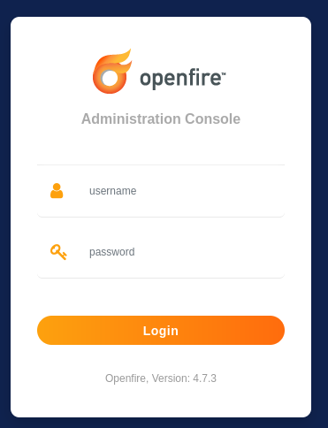

For this version I found an exploit on GitHub:

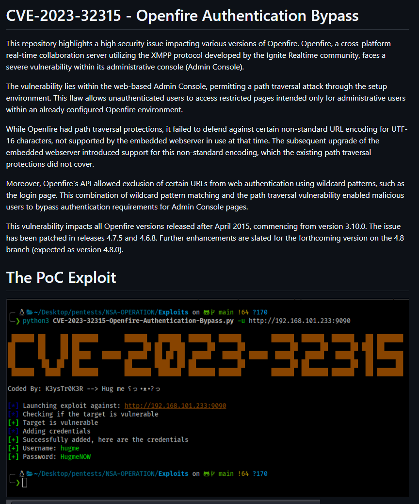

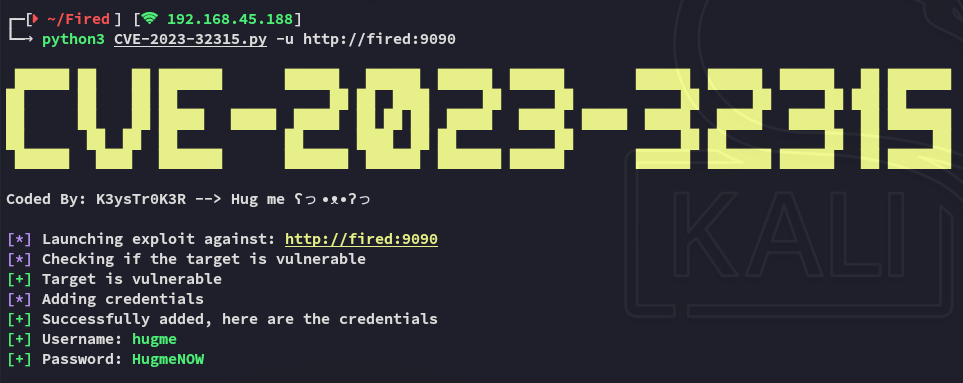

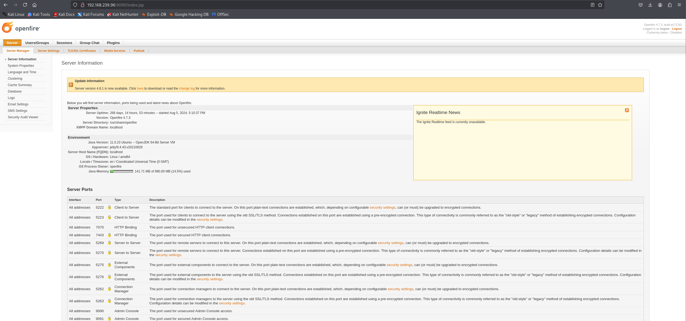

Easy access.

I went to the `Email Settings` were I found the following:

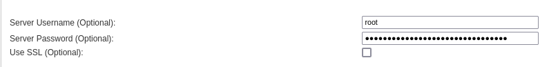

```
root
7500e014a4f590847aed85e89117a853
```

Might come in handy.

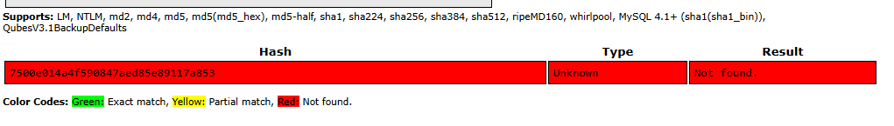

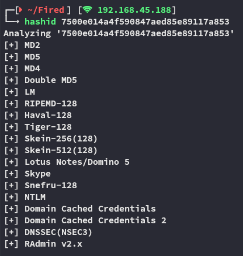

Unfortunately I was not successfull in cracking it.

## CVE-2023-32315

I found [the following PoC](https://www.vicarius.io/vsociety/posts/cve-2023-32315-path-traversal-in-openfire-leads-to-rce) on how to get RCE from here:

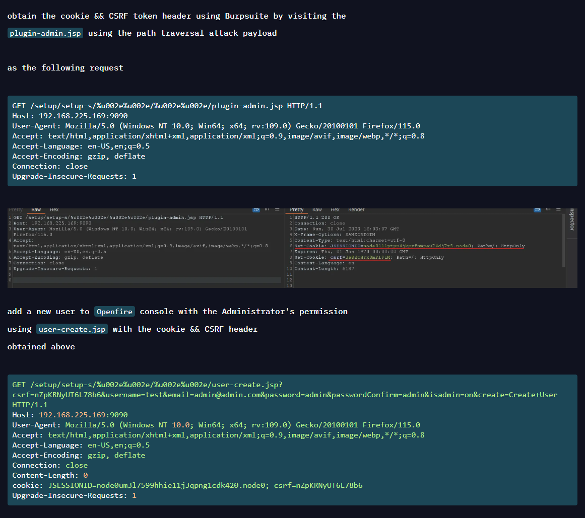

I followed up the instructions:

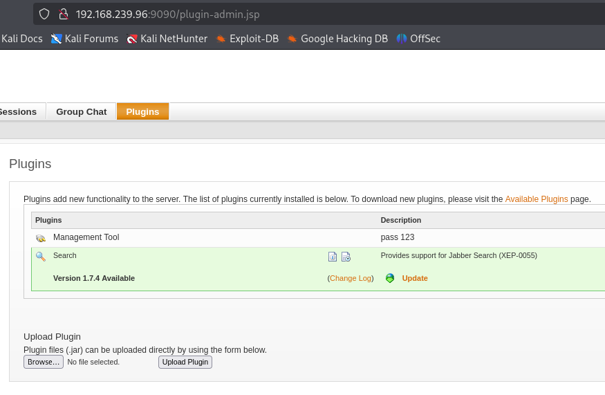

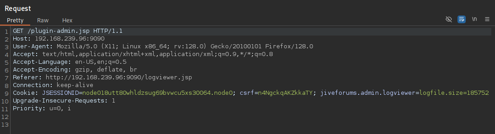

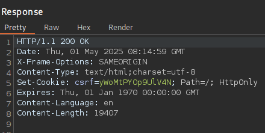

>[!important]
>Since we already have a `csrf` cookie we don't actually have to manipulate any requests which makes it way easier, we just have to go to the `/create-user.jsp` endpoint and create an admin user.

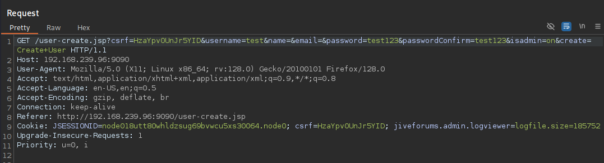

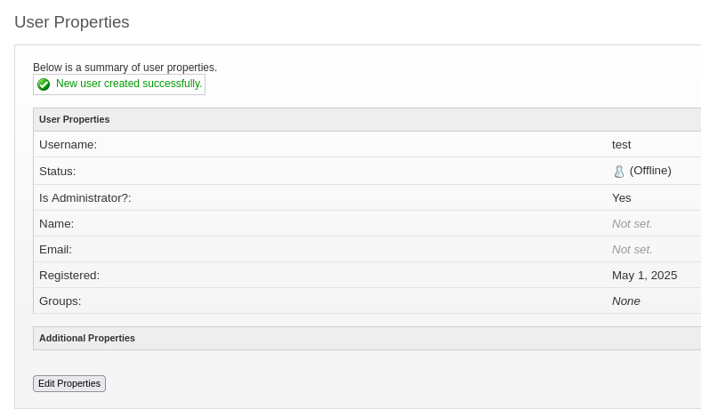


### Vulnerable Plugin

From here on we have to upload a vulnerable plugin which should give us RCE:

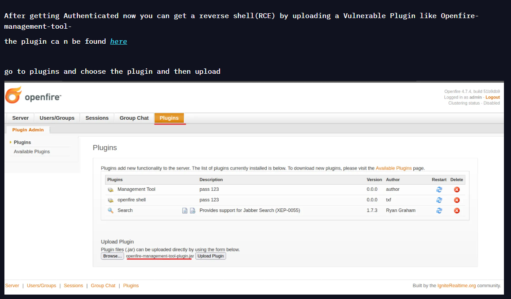

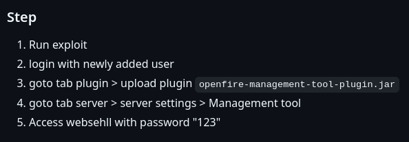

Since we already have access and the created user we just have to download and upload the plugin.

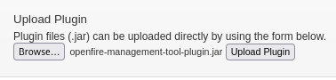

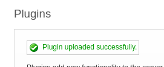

### RCE

Next up we head to **Server -> Server Settings -> Management Tool**

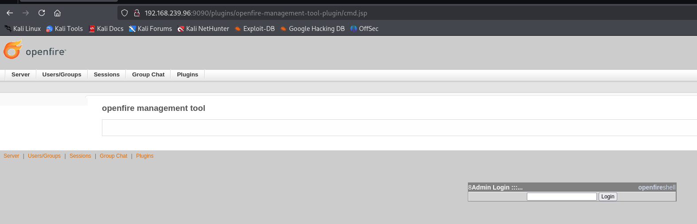

The password is `123`. We then click on **system command** in the dropdown:

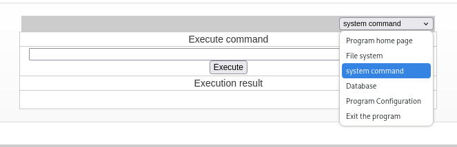

We can now execute commands:

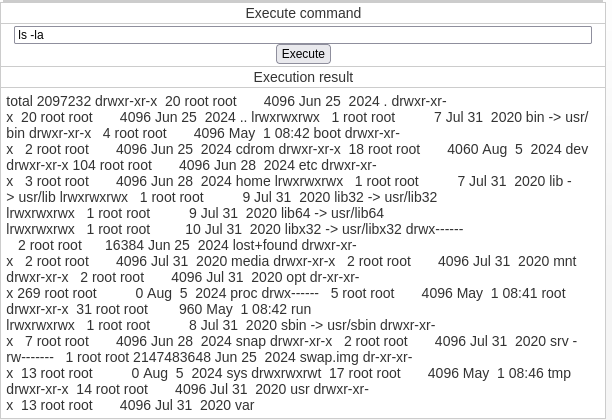

# Foothold
## Shell as openfire

I use the following to get a reverse shell:

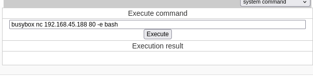

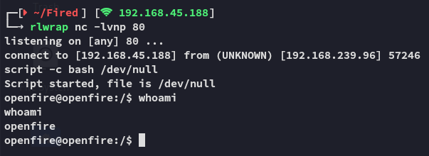

This user has a `/home` directory so let's get the `local.txt` flag.

### local.txt

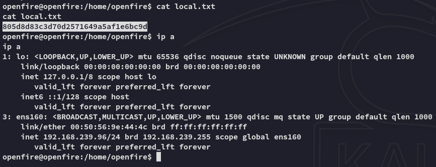

Other than that the directory is empty:

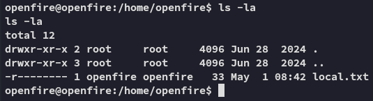

## Enumeration

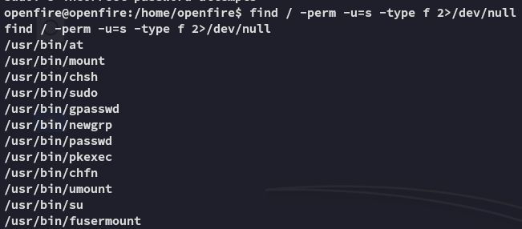

I tried to transfer over files:

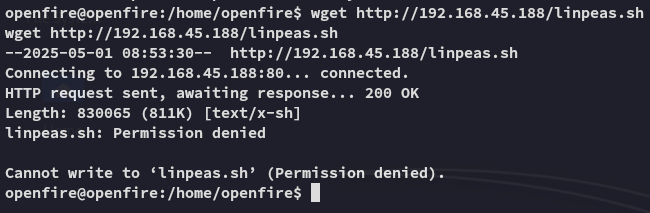

>[!fail]
>Well that's new, let's see whether we can transfer them to the `/tmp` directory instead.

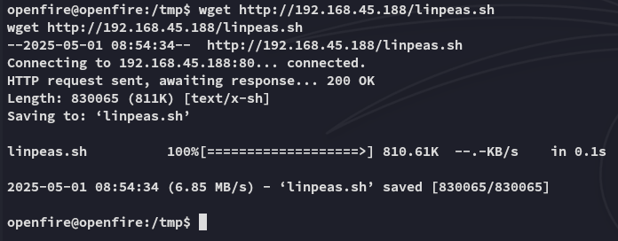

This worked like a charm, I transferred over `pspy` as well.

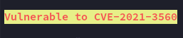

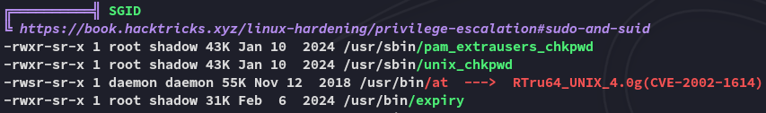

However I couldn't find anything interesting, thus I went into the `/usr/share/openfire` directory where I started snooping around.


# Privilege Escalation
## SSH as root

I found the following inside the `openfire.script` file:

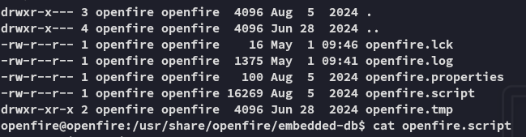

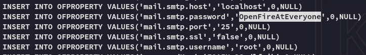

```
root
OpenFireAtEveryone
```

I could now log in via `ssh` and make my life easier.


## proof.txt

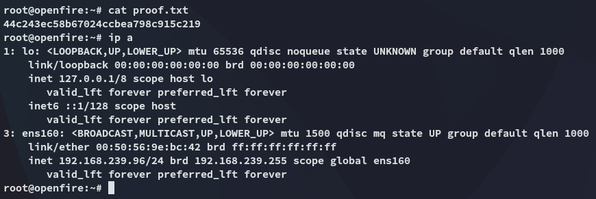

>[!summary]
>As with previous OffSec boxes, there's a main CVE which creates the access, and then you need to enumerate really well and the privesc is super simple.

---

**Finished 11:52 01-05-2025**

[^Links]: [[OSCP Prep]]

#CVE #enumeration 